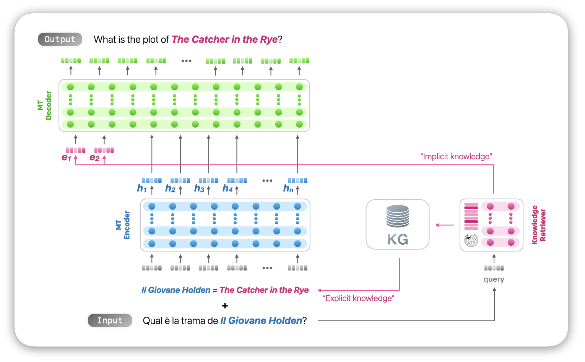

# Towards Cross-Cultural Machine Translation with Retrieval-Augmented Generation from Multilingual Knowledge Graphs

[**Overview**](#overview) |
[**Paper**](https://arxiv.org/abs/2410.14057) |
[**XC-Translate**](#xc-translate-benchmarking-entity-centric-cross-cultural-machine-translation) |
[**Evaluation**](#how-to-evaluate-your-model-on-xc-translate) |
[**KG-MT**](#kg-mt-integrating-multilingual-knowledge-graphs-into-machine-translation) |
[**Citation**](#citation) |
[**License**](#license)

Translating text that contains entity names is a challenging task, as cultural-related references can vary significantly across languages. These variations may also be caused by transcreation, an adaptation process that entails more than transliteration and word-for-word translation. In this paper, we address the problem of cross-cultural translation on two fronts: (i) we introduce **XC-Translate**, the first large-scale, manually-created benchmark for machine translation that focuses on text that contains potentially culturally-nuanced entity names, and (ii) we propose **KG-MT**, a novel end-to-end method to integrate information from a multilingual knowledge graph into a neural machine translation model by leveraging a dense retrieval mechanism. Our experiments and analyses show that current machine translation systems and large language models still struggle to translate texts containing entity names, whereas KG-MT outperforms state-of-the-art approaches by a large margin, obtaining a 129% and 62% relative improvement compared to NLLB-200 and GPT-4, respectively.
 
> [!note]
> Please refer to our [**EMNLP 2024**](https://2024.emnlp.org/) paper for more details, [Towards Cross-Cultural Machine Translation with Retrieval-Augmented Generation from Multilingual Knowledge Graphs](https://arxiv.org/abs/2410.14057).

## Contents
* [XC-Translate: Benchmarking Entity-Centric Cross-Cultural Machine Translation](#xc-translate-benchmarking-entity-centric-cross-cultural-machine-translation)
    * [Languages](#languages)
    * [Stats](#stats)
    * [Data organization](#data-organization)
    * [Data format](#data-format)
    * [Examples](#examples)
* [How to Evaluate Your Model on XC-Translate](#how-to-evaluate-your-model-on-xc-translate)
    * [Before you start](#before-you-start)
    * [Evaluate your model](#evaluate-your-model)
* [KG-MT: Integrating Multilingual Knowledge Graphs into Machine Translation](#kg-mt-integrating-multilingual-knowledge-graphs-into-machine-translation)
    * [Model Overview](#model-overview)
    * [Results on XC-Translate](#results-on-xc-translate)
* [Citation](#citation)
* [License](#license)
* [Acknowledgements](#acknowledgements)


## XC-Translate: Benchmarking Entity-Centric Cross-Cultural Machine Translation
We introduce **XC-Translate**, a benchmark for evaluating machine translation systems on text that contains entities whose names may differ significantly from language to language. XC-Translate evaluates the ability of machine translation systems (NMT systems as well as LLMs) on 10 language pairs from English to Arabic, German, Spanish, French, Italian, Japanese, Korean, Thai, Turkish and Chinese.

> [!warning]
> We kindly ask developers to **refrain from using XC-Translate for training or fine-tuning their models**. Instead, we encourage researchers to use XC-Translate for evaluation purposes only.

### Languages
XC-Translate currently includes the following language pairs:
* `en` to `ar` - English to **Arabic**
* `en` to `de` - English to **German**
* `en` to `es` - English to **Spanish**
* `en` to `fr` - English to **French**
* `en` to `it` - English to **Italian**
* `en` to `ja` - English to **Japanese**
* `en` to `ko` - English to **Korean**
* `en` to `th` - English to **Thai**
* `en` to `tr` - English to **Turkish**
* `en` to `zh` - English to **Chinese**

### Stats
The dataset contains around 4,000 to 6,000 rows for each language pair, with a total of ~58,000 rows across all language pairs. More specifically:

| Language Pair | # of Rows |
|---------------|-----------|
| en-ar         | 5,339     |
| en-de         | 6,677     |
| en-es         | 6,149     |
| en-fr         | 6,264     |
| en-it         | 5,901     |
| en-ja         | 5,904     |
| en-ko         | 5,900     |
| en-th         | 4,230     |
| en-tr         | 5,280     |
| en-zh         | 5,977     |
| **Total**     | **57,621**|

### Data organization
The data is organized in the following way:
```
data/
└── xct
    ├── predictions
    │   ├── to_ar_AE
    │   ├── to_de_DE
    │   ├── to_es_ES
    │   ├── to_fr_FR
    │   ├── to_it_IT
    │   │   ├── it_IT.gpt-3.5.json
    │   │   ├── it_IT.gpt-3.json
    │   │   ├── it_IT.gpt-4.json
    │   │   ├── it_IT.kgmt-m2m.json
    │   │   ├── it_IT.kgmt-mbart.json
    │   │   ├── it_IT.kgmt-nllb.json
    │   │   ├── it_IT.m2m.json
    │   │   ├── it_IT.mbart.json
    │   │   └── it_IT.nllb.json
    │   ├── to_ja_JP
    │   ├── to_ko_KR
    │   ├── to_th_TH
    │   ├── to_tr_TR
    │   └── to_zh_TW
    ... 
    └── references
        └── all
            ├── ar_AE.jsonl
            ├── de_DE.jsonl
            ├── es_ES.jsonl
            ├── fr_FR.jsonl
            ├── it_IT.jsonl
            ├── ja_JP.jsonl
            ├── ko_KR.jsonl
            ├── th_TH.jsonl
            ├── tr_TR.jsonl
            └── zh_TW.jsonl
```
Where:
* `data/xct/all/references/` contains the human-curated translations for each language pair.
* `data/xct/predictions/` contains the predictions for each language pair and model. We provide the predictions by the models studied in the paper for reproducibility purposes.

### Data format
Each row in the dataset contains the following fields:
```json
{
  "id": "Q2461698_0",
  "wikidata_id": "Q2461698",
  "entity_types": [
    "Fictional entity"
  ],
  "source": "Who are the main antagonistic forces in the World of Ice and Fire?",
  "targets": [
    {
      "translation": "Chi sono le principali forze antagoniste nel mondo delle Cronache del ghiaccio e del fuoco?",
      "mention": "mondo delle Cronache del ghiaccio e del fuoco"
    }
  ],
  "source_locale": "en",
  "target_locale": "it"
}
```
Where:
* `id` is a unique identifier for the row, usually in the format `<entity_id>_<q_id>`, where `<entity_id>` is the entity ID in Wikidata and `<q_id>` is the question ID (from 0 to 4).
* `wikidata_id` is the QID of the entity in Wikidata.
* `entity_types` is a list of types of the entity; not all entities have types.
* `source` is the source text in English.
* `targets` is a list of translations in the target language, where each translation contains:
    * `translation` is the translation of the source text in the target language.
    * `mention` is the mention of the entity in the translation.
* `source_locale` is the source language.
* `target_locale` is the target language.

In the example above, the entity is the "World of Ice and Fire" and the translation is "mondo delle Cronache del ghiaccio e del fuoco", which are not 1-to-1 translations as the Italian version also includes "delle Cronache" ("of the Chronicles"). You can check out more examples below.

### Examples
* **Ring a Ring o' Roses** is translated as **Girotondo** in Italian:
  ```json
  {
    "id": "Q746666_0",
    "wikidata_id": "Q746666",
    "entity_types": [
      "Musical work"
    ],
    "source": "Can you sing the chorus of the folk song Ring a Ring o' Roses?",
    "targets": [
      {
        "translation": "Puoi cantare il ritornello della canzone popolare Girotondo?",
        "mention": "Girotondo"
      },
      {
        "translation": "Sai cantare il ritornello del girotondo, la canzone popolare?",
        "mention": "girotondo"
      }
    ],
    "source_locale": "en",
    "target_locale": "it"
  }
  ```

* **Mary of Burgundy** is translated as **Maria di Borgogna** and **Maximilian I** is translated as **Massimiliano I** in Italian:
  ```json
  {
    "id": "Q157073_0",
    "wikidata_id": "Q157073",
    "entity_types": [
      "Person"
    ],
    "source": "How long was Mary of Burgundy married to Emperor Maximilian I?",
    "targets": [
      {
        "translation": "Per quanto tempo Maria di Borgogna è stata sposata con l'imperatore Massimiliano I?",
        "mention": "Maria di Borgogna"
      },
      {
        "translation": "Per quanto tempo Maria di Borgogna è stata sposata con l'imperatore Massimiliano I",
        "mention": "Maria di Borgogna"
      }
    ],
    "source_locale": "en",
    "target_locale": "it"
  }
  ```

* **Little Women** is translated as **Mujercitas** in Spanish:
  ```json
  {
    "id": "Q850522_0",
    "wikidata_id": "Q850522",
    "entity_types": [
      "Movie"
    ],
    "source": "Who are the main characters in the movie Little Women?",
    "targets": [
      {
        "translation": "¿Quiénes son los personajes principales de la película Mujercitas?",
        "mention": "Mujercitas"
      }
    ],
    "source_locale": "en",
    "target_locale": "es"
  }
  ```

* **A Room of One's Own** is translated as **Una habitación propia** in Spanish:
  ```json
  {
    "id": "Q1204366_1",
    "wikidata_id": "Q1204366",
    "entity_types": [
      "Book"
    ],
    "source": "Who is the author of the book A Room of One's Own?",
    "targets": [
      {
        "translation": "¿Quién es el autor del libro Una habitación propia?",
        "mention": "Una habitación propia"
      },
      {
        "translation": "¿Quién es el autor del libro Una habitacion propia?",
        "mention": "Una habitacion propia"
      }
    ],
    "source_locale": "en",
    "target_locale": "es"
  }
  ```

## How to Evaluate Your Model on XC-Translate
Read this section to learn how to evaluate your machine translation model and/or large language model on XC-Translate using the official evaluation script.

### Before you start
We recommend using a virtual environment, such as `conda` or `venv`, to install the required dependencies. You can create a new environment using the following command:
```bash
# Create a new conda environment.
conda create -n kg-mt python=3.10
```

Once you have created the environment, activate it and install the required dependencies using the following command:
```bash
# Activate the conda environment.
conda activate kg-mt

# Install the required dependencies.
pip install -r requirements.txt
```

### Evaluate your model
To evaluate your model on XC-Translate, you need to provide the predictions in the following format:
```json
{
  "id": "Q627784_0",
  "prediction": "Come viene ricordato e onorato Yu il Grande nella storia e cultura cinese di oggi?",
}
```
Where:
* `id` is the unique identifier of the row, i.e., `<entity_id>_<q_id>` from the source data.
* `prediction` is the predicted translation in the target language.

You can then evaluate your predictions using the following command:
```bash
python src/evaluation/evaluate.py \
  --references data/xct/references/all/it_IT.jsonl \
  --predictions data/xct/predictions/to_it_IT/it_IT.gpt-4.json
```
Where:
* `--references` is the path to the reference file.
* `--predictions` is the path to the predictions file.

<details>
<summary><strong>Extra flags</strong></summary>

You can also use the following flags to customize the evaluation:
```bash
python src/evaluation/evaluate.py \
  --references data/xct/references/all/it_IT.jsonl \
  --predictions data/xct/predictions/to_it_IT/it_IT.gpt-4.json \
  --entity_types "Movie" "TV series" \
  --verbose
```
Where:
* `--entity_types` is a list of entity types to filter the evaluation. You can check the script for the available entity types.
* `--verbose` is a flag to print additional information during the evaluation, including all the wrong predictions.
</details>

The evaluation script will output the m-ETA (manual Entity Translation Accuracy) score, which is the percentage of correctly translated entities in the predictions. More specifically, m-ETA checks if one of the valid entity mentions (provided by human annotators in the reference) is present in the predicted translation. If at least one of the valid entity mentions is present in the predicted translation, the entity is considered correctly translated. A higher m-ETA score indicates better performance.


#### Evaluation output
The evaluation script will output the following information:
```
INFO | Running evaluation on XC-Translate with the following parameters:
INFO |  - References: data/xct/references/all/it_IT.jsonl
INFO |  - Predictions: data/xct/predictions/to_it_IT/it_IT.gpt-4.json
INFO |  - Entity types: None
INFO |  - Verbose: False
INFO | 
INFO | Loading data from data/xct/references/all/it_IT.jsonl...
INFO | Loaded 5901 instances.
INFO | Loading data from data/xct/predictions/to_it_IT/it_IT.gpt-4.json...
INFO | Loaded 5549 predictions.
INFO | Computing entity name translation accuracy...
INFO | 
INFO | =============================================
INFO | Evaluation results:
INFO | Correct instances   = 2057
INFO | Total instances     = 5901
INFO | -----------------------------
INFO | m-ETA               = 34.86
INFO | =============================================
INFO | 
INFO | Evaluation completed.
```

## KG-MT: Integrating Multilingual Knowledge Graphs into Machine Translation
In our paper, we also propose **KG-MT**, a novel end-to-end method to integrate information from a multilingual knowledge graph into a neural machine translation model by leveraging a dense retrieval mechanism. KG-MT outperforms state-of-the-art approaches by a large margin, obtaining a 129% and 62% relative improvement compared to NLLB-200 and GPT-4, respectively.

### Model Overview
An overview of the KG-MT architecture is shown below:
<p align="center">
  
</p>

We provide the code for KG-MT in the `src/` directory for reproducibility purposes. The code includes the following components:
* **Retriever**: A dense retrieval mechanism to retrieve relevant entities from the multilingual knowledge graph. The code is based on the Contriever implementation. We further fine-tune the retriever as described in the paper.
* **Translator**: A neural machine translation model that integrates the retrieved entities into the translation process. Our code allows a user to pick a specific model from MBART, M2M, and NLLB.

You can check out the code and the instructions in the `src/` directory, where you will find more details on how to run the code and reproduce the results.

### Results on XC-Translate
We provide the predictions for KG-MT on XC-Translate in the `data/xct/predictions/` directory. You can use the evaluation script to compare the performance of KG-MT with other models on XC-Translate.

```bash
# Evaluate KG-MT (NLLB-200 version) on XC-Translate.
python src/evaluation/evaluate.py \
  --references data/xct/references/all/it_IT.jsonl \
  --predictions data/xct/predictions/to_it_IT/it_IT.kgmt-nllb.json

# Output:
# INFO | Running evaluation on XC-Translate with the following parameters:
# INFO |  - References: data/xct/references/all/it_IT.jsonl
# INFO |  - Predictions: data/xct/predictions/to_it_IT/it_IT.kgmt-nllb.json
# INFO |  - Entity types: None
# INFO |  - Verbose: False
# INFO | 
# INFO | Loading data from data/xct/references/all/it_IT.jsonl...
# INFO | Loaded 5901 instances.
# INFO | Loading data from data/xct/predictions/to_it_IT/it_IT.kgmt-nllb.json...
# INFO | Loaded 5829 predictions.
# INFO | Computing entity name translation accuracy...
# INFO | 
# INFO | =============================================
# INFO | Evaluation results:
# INFO | Correct instances   = 2771
# INFO | Total instances     = 5901
# INFO | -----------------------------
# INFO | m-ETA               = 46.96
# INFO | =============================================
# INFO | 
# INFO | Evaluation completed.
```

You can also check out the results for KG-MT based on different models (MBART, M2M, NLLB) using the predictions in the `data/xct/predictions/` directory.


## Citation
Please cite our work if you found this repository (data and/or code) useful:

```bibtex
@inproceedings{conia-etal-2024-towards,
    title = "Towards Cross-Cultural Machine Translation with Retrieval-Augmented Generation from Multilingual Knowledge Graphs",
    author = "Conia, Simone  and
      Lee, Daniel  and
      Li, Min  and
      Minhas, Umar Farooq  and
      Potdar, Saloni  and
      Li, Yunyao",
    booktitle = "Proceedings of the 2024 Conference on Empirical Methods in Natural Language Processing",
    month = nov,
    year = "2024",
    address = "Miami, Florida, USA",
    publisher = "Association for Computational Linguistics",
}
```

## License
The code in this repository is released under the [LICENSE.txt](LICENSE.txt) terms.

XC-Translate is partially derived from information available in Wikipedia and Wikidata, and it is licensed under the same license CC BY-SA, see the [LICENSE.wiki.txt](LICENSE.wiki.txt) file.

This repository uses software developed by third parties, which are licensed under their respective licenses. Please refer to the [ACKNOWLEDGEMENTS](ACKNOWLEDGEMENTS) file for more information.

## Acknowledgements
From Simone:
> This work is part of one of the projects that we started at Apple.
>
> I must truly thank Min Li, Saloni Potdar and Yunyao Li for their incredible mentorship and for everything they taught me.
> I would also like to thank Umar Farooq Minhas, Behrang Mohit, and Ihab Ilyas for their valuable feedback.
> Besides his technical contributions, I would like to thank Daniel Lee for making this project more fun, and Farima Fatahi Bayat, Ronak Pradeep, and Revanth Gangi Reddy for making this internship a unique experience.
> This work would not have been possible without the support of the Apple AI/ML team, and I am grateful for the opportunity to work with such talented and inspiring people.
>
> Finally, I would like to gratefully acknowledge the support of Future AI Research ([PNRR MUR project PE0000013-FAIR](https://fondazione-fair.it/en/)), which fully funds my fellowship at Sapienza University of Rome since October 2023.
